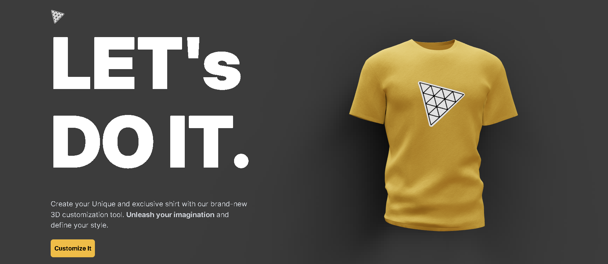

# Introduction

Create your own style with our new 3D Swag Customization App. Pick colors, add logos, and try AI designs to make your virtual swag unique. Built using React.js, Three.js, and OpenAI to show the usage of a 3D world with AI

If you're getting started and need assistance or face any bugs, join our active Discord community with over 27k+ members. It's a place where people help each other out.

# Tech Stack

- React.js
- Three.js
- React Three Fiber
- React Three Drei
- Vite
- Tailwind CSS
- Node.js
- Express.js
- OpenAI
- Framer Motion
- Valtio

# Features

👉 3D Swag Generation: Generate unique 3D shirts/swag items dynamically

👉 Color Customization: Apply any color to the 3D shirt/swag for personalized styling.

👉 Logo Upload Functionality: Enable users to upload any file as a logo, integrating it seamlessly onto the 3D shirt.

👉 Texture Image Upload: Allow users to upload texture images to style the 3D shirt/swag.

👉 AI-Generated Logo Integration: Utilize AI to generate logos and intelligently apply them to the 3D shirt.

👉 AI-Generated Textures: Implement AI-generated textures for enhanced 3D shirt customization.

👉 Download Options:Dynamically change the application theme based on the selected color, enhancing user experience.

👉 Theme Change with Color Selection: Dynamically change the application theme based on the selected color, enhancing user experience

👉 Responsive 3D Application: Ensure the application is responsive, delivering a seamless experience across various devices.

👉 Framer Motion Animation: Implement framer motion animations for smooth transitions between different 3D models.

and many more, including code architecture and reusability
